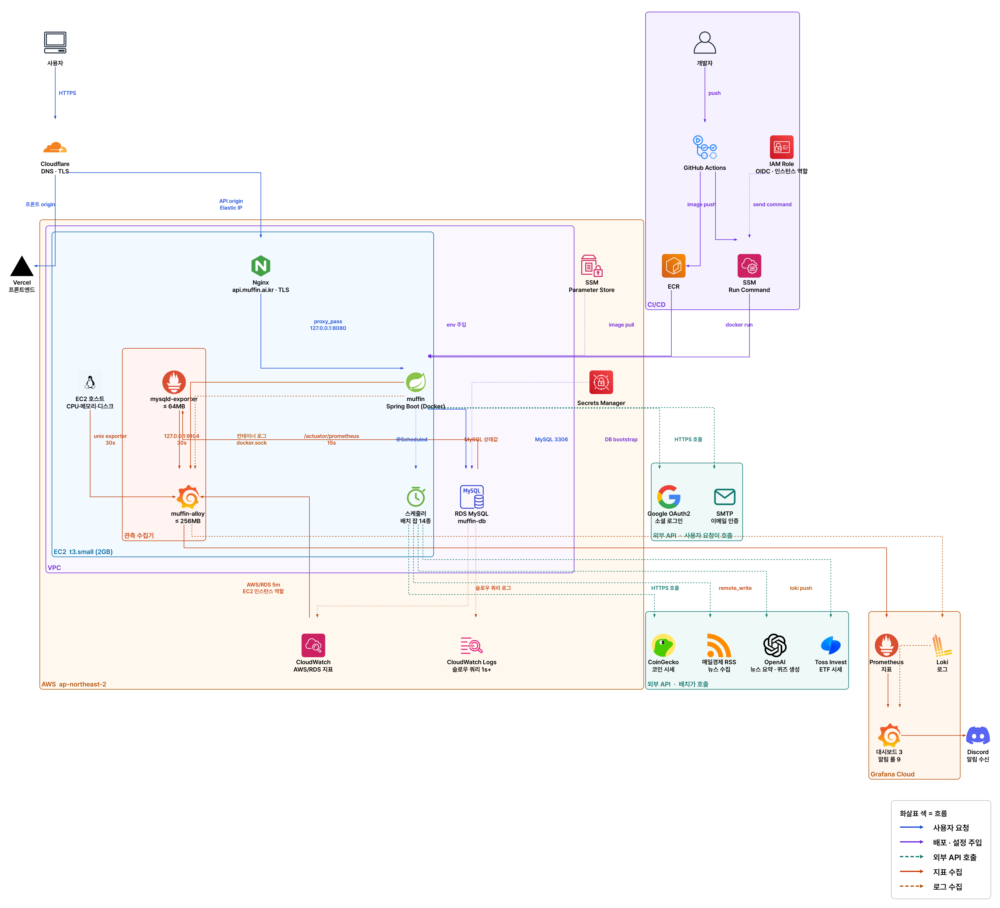

<div align="center">


# 🧁 Muffin

### 매일 아침 가볍게 즐기는 금융 핀셋 가이드

**AI가 오늘의 경제 뉴스를 초보자 눈높이로 풀어 주고,<br/>
그 뉴스가 실제 시장에 미친 영향을 모의투자로 직접 확인하며 배우는 경제 학습 서비스**

<br/>

<a href="https://muffin.ai.kr/">

</a>

<br/><br/>

<a href="https://api.muffin.ai.kr/docs/index.html">

</a>
<a href="https://youtube.com/playlist?list=PLYG1U37V1liU&si=UsV1ClLLreJ2shlQ">

</a>

<br/><br/>


</div>

<br/>

## ✨ 주요 기능

<div align="center">
<table>
<tr>
<td width="430" valign="top">

### 📰 오늘의 뉴스

- RSS로 모은 경제 뉴스를 **AI가 초보자 눈높이로 재구성**
- 어려운 용어는 본문에서 **하이라이트 → 탭하면 뜻풀이**
- 단계별 **해설 카드**로 배경까지 이해
- 스크랩 · 최근 읽은 뉴스 · 용어 저장

</td>
<td width="430" valign="top">

### 🧠 오늘의 한입 퀴즈

- 그날 뉴스로 만든 **하루 3문항** 퀴즈
- 제출 즉시 **정답 · 해설 · 진행률** 확인
- 정답 수에 따라 **가상 머니 보상** 지급
- 학습 저장소에서 지난 퀴즈 **복습**

</td>
</tr>
</table>
</div>

<div align="center">
<table>
<tr>
<td width="430" valign="top">

### 📈 섹터 모의투자

- 뉴스가 **어느 섹터에 호재/악재**인지 보고 투자 결정
- 가상 머니로 **섹터별 수량 배분**
- 실제 **ETF 시가·종가로 매일 자동 정산**
- 자정 마감 전까지 자유롭게 수정

</td>
<td width="430" valign="top">

### 📊 성과 & 랭킹

- 누적 수익률 **그래프**와 TOP3 섹터
- 일 · 주 · 월 · 년 **기간별 손익 내역**
- 응답 결과와 스트릭으로 정해지는 **투자 성향 캐릭터**
- 주간 수익률 **TOP 10 랭킹**과 내 순위

</td>
</tr>
</table>
</div>

<br/>

## 🛠 기술 스택

<div align="center">

**Backend**


**Database**


**AI · 외부 연동**


**Infra · CI/CD**


**Observability · Docs**


</div>

<br/>

## 🏗 아키텍처

<div align="center">



</div>

<br/>

## 🧱 개발 방식

**DDD 기반**: 도메인으로 먼저 나누고 그 안에서 레이어를 나눕니다. 비즈니스 규칙은 서비스가 아니라 **엔티티 안에** 둡니다.


```
// 의존 방향
presentation  →  application  →  domain
   진입점          트랜잭션·조립      규칙 본체
                                    ↑
                              infrastructure
                                  외부 연동
```

```
// 패키지 레이어 구조
com/muffin/investment/            ← 도메인 (news · quiz · sector · stats · ranking · auth ...)
├── presentation/                 컨트롤러 · 스케줄러 · DTO · Swagger
├── application/                  CommandService(쓰기) · QueryService(읽기)
├── domain/investment/            애그리거트 : Investment + InvestmentSector
│         userasset/              애그리거트 : UserAsset
└── infrastructure/               QueryDSL · 외부 API · AI 클라이언트
```

| 규칙 | 내용 |
| --- | --- |
| 🚫 `@Setter` 금지 | 상태 변경은 `settle()` 같은 **동사 메서드**로만 |
| 📦 애그리거트 단위 | 루트마다 리포지토리 1개, 자식 전용 리포지토리 없음 |
| 🔗 ID 참조 | 애그리거트 경계는 FK 대신 ID로 참조 |
| ↔️ CQRS | 쓰기는 애그리거트 루트로, 읽기는 DTO로 직접 projection |
| ➡️ 단방향 의존 | `domain`은 컨트롤러·DTO를 모름 |

### 협업 규칙

- 🌿 **브랜치** : `feat/#이슈번호` → `dev` 로만 PR, `main` 에는 `dev` · `hotfix` 만
- 📝 **커밋** : `[타입/#이슈번호] 제목` + 본문 불릿 (`feat` `fix` `docs` `setting` `refactor` `test` `deploy` `chore`)
- 🔍 **PR** : 작은 PR 규칙 도입; 1,000줄 이내로 쪼개기, **approve 1인 + CI 통과**해야 머지
- 🎨 **포맷팅** : `palantirJavaFormat` + Spotless, 빌드 시 자동 실행하고 CI에서 검사
- 🗃️ **스키마** : Flyway 마이그레이션으로만 변경, 운영은 `ddl-auto: validate`
- ✅ **테스트** : 함수명은 영어로 간결하게, `@DisplayName`은 한국어로 읽기 좋게

<br/>

## 👥 팀원

<div align="center">
<table>
<tr>
<td align="center" width="172">
<a href="https://github.com/yeonthusiast">
<br/>
<b>@yeonthusiast</b>
</a><br/> 
👑 리드 <br/>
📈 모의투자 · 정산<br/>
📊 통계
</td>
<td align="center" width="172">
<a href="https://github.com/skays1212">
<br/>
<b>@skays1212</b>
</a><br/>
팀원 <br/>
📰 AI · 뉴스<br/>
☁️ 인프라
</td>
<td align="center" width="172">
<a href="https://github.com/sekong11">
<br/>
<b>@sekong11</b>
</a><br/>
팀원<br/>
🧠 AI · 퀴즈<br/>
📰 뉴스
</td>
<td align="center" width="172">
<a href="https://github.com/LeeJeongHeon02">
<br/>
<b>@LeeJeongHeon02</b>
</a><br/>
팀원<br/>
🏷️ 섹터 · ETF 시세<br/>
🏆 랭킹
</td>
<td align="center" width="172">
<a href="https://github.com/Eugene-Shin">
<br/>
<b>@Eugene-Shin</b>
</a><br/>
팀원<br/>
🔐 인증 · 회원<br/>
🔔 알림
</td>
</tr>
</table>
</div>

<br/>

## 📁 저장소 구조

```
muffin-back/
├── backend/        Spring Boot 애플리케이션 (도메인별 → 레이어 DDD 구조)
├── infra/
│   ├── terraform/  AWS 인프라 (EC2 · RDS · ECR · IAM · 네트워크)
│   └── monitoring/ Grafana Alloy 수집기 설정
└── .github/        CI · CD 워크플로
```

<br/>

<div align="center">

**🧁 Muffin** · Made with care by the money-pin team

<sub>2026. 08. 11. ver.</sub>

</div>
